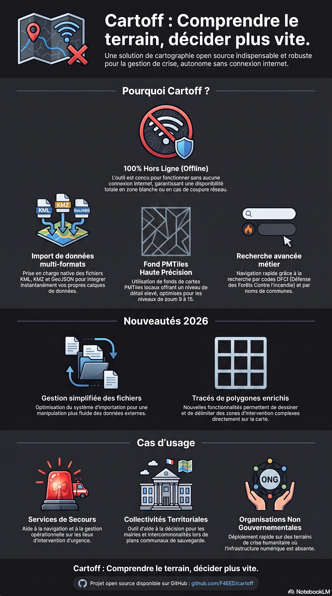

# 🚨 Cartoff

## Comprendre le terrain, décider plus vite.



**Cartoff** est un outil de cartographie open source dédié à la **gestion de crise**, conçu pour fonctionner **100 % hors ligne**.

> ✅ Pensé pour les environnements dégradés  
> ✅ Fonctionne sans aucune connexion réseau  
> ✅ Basé sur Leaflet  

---

## 🧪 À propos du projet

Cartoff est avant tout un **POC (Proof of Concept)**.

👉 Objectif initial :  
explorer les possibilités de **Leaflet** pour créer un outil de cartographie utilisable en conditions réelles de crise.

Au fil des expérimentations, le projet a évolué vers un cas d’usage concret :

💥 **la gestion de crise en environnement sans connectivité**

---

## 🌍 Pourquoi Cartoff ?

En situation de crise (inondation, catastrophe naturelle, incident industriel),  
les réseaux sont souvent indisponibles.

👉 Mais les décisions, elles, ne peuvent pas attendre.

Cartoff répond à ce besoin :

- fournir une **cartographie opérationnelle**
- disponible **sans internet**
- simple, rapide et utilisable sur le terrain

---

## 🌊 Cas concret : inondation de la Loire

Crue soudaine :

- 🌊 zones inondées  
- 🚧 routes coupées  
- 📡 réseau indisponible  

👉 Les équipes terrain doivent malgré tout :
- comprendre la situation  
- se coordonner  
- continuer à intervenir  

### ✅ Avec Cartoff

- 🗺️ visualiser immédiatement les zones impactées  
- 🚧 identifier les routes impraticables  
- 📍 positionner des points critiques (panneaux, tronçons, zones)  
- 🔲 délimiter des périmètres ou zones inondées en polygone  
- ⚡ travailler **100 % hors ligne**  

💥 Résultat : décisions plus rapides, meilleure coordination.

---

## ⚙️ Fonctionnalités

### Carte et fond

- 🗺️ Fond vectoriel **PMTiles** (OSM, zoom 9–15, emprise Loire) via [protomaps-leaflet](https://github.com/protomaps/PMTiles)
- 📐 Boîte de coordonnées : WGS84, UTM, **DFCI**, commune au survol, altitude (MNT Copernicus)
- 🔌 Fonctionnement entièrement offline après préparation des données

### Calques GeoJSON (OSM)

- Calques thématiques du département 42 (urgence, santé, aviation, toponymie, etc.)
- **Chargement à la demande** : un calque n’est téléchargé que lorsqu’il est coché
- Rendu **canvas** pour les calques lourds (communes, zones, carroyage DFCI)

### Carroyage DFCI

- Grilles **2 km**, **20 km** et **100 km** (découpe départementale)
- Chargement lazy ; le calque 2 km (~5 000 mailles) est marqué ⚠ lourd
- **Recherche par code DFCI** (ex. `HF26H4`, `HF`) dans la section Recherche

### Constats / événements de situation

Calque autonome pour saisir l’état opérationnel sur le terrain :

| Géométrie | Saisie | Exemples de types |
|-----------|--------|-------------------|
| **Point** (panneau) | Clic droit → « Point (panneau) » | Accident, route barrée, incendie… |
| **Tronçon** (ligne) | Clic droit → « Tronçon (ligne) » | Route inondée, travaux, déviation… |
| **Zone** (polygone) | Clic droit → « Zone (surface) » | Zone inondée, périmètre, incendie… |

- Menu contextuel (clic droit) pour ajouter, modifier, activer/désactiver ou supprimer
- Dessin ligne / polygone : clics successifs, **Terminer**, **Annuler** ou **Échap**
- Types définis dans `js/poi-types.js` (panneaux, styles ligne/polygone)
- Persistance **`localStorage`** (`cartoff_situation_constats`) + **export GeoJSON**
- Calque chargé à la demande (cocher « Constats / événements »)

### Missions SAR (recherche et sauvetage)

Section **Missions SAR** pour structurer une opération de recherche :

#### Mission personne (SAR-1)

| Élément | Saisie | Rôles |
|---------|--------|-------|
| **Point** | Mode SAR + clic droit ou bouton barre latérale | LKP, Indice, Waypoint |
| **Polyligne** | Clics + **Terminer** (comme les tronçons constats) | Axe probable |
| **Polygone** | Clics + **Terminer** (min. 3 points, comme les zones constats) | Fouilles (zone fouillée) |

#### Mission aéronef — DF / balise (SAR-2)

| Élément | Saisie | Rôle |
|---------|--------|------|
| **Station DF** | Bouton **Station DF**, clic droit carte ou clic sur la carte | Point `station_df` (marqueur ▲ orange) |
| **Relèvement** | Bouton **Relèvement**, menu contextuel sur une station, ou clic sur station si plusieurs | Paire de lignes `relevement_df` |

Workflow aéronef :

1. Créer une mission type **Aéronef**, activer **Mode SAR**
2. Placer une **station DF** (libellé, notes, horodatage optionnel)
3. Ajouter un **relèvement** : azimut (0–360°, 1 décimale), portée en km (défaut 30 km)
4. Carte : **ligne réception** (pleine, orange) vers l’azimut saisi ; **ligne réciproque** (pointillée, +180°)
5. Modifier ou supprimer station / relèvement via panneau ou menu contextuel (suppression station → relèvements liés)

- Création de missions : nom, type **personne** ou **aéronef**
- Mission active, statut **active** / **clôturée**, suppression
- Métadonnées par élément : libellé, notes, horodatage automatique (modifiable pour station DF)
- Symbologie distincte des constats (marqueurs colorés, zone verte remplie, axe violet, DF orange)
- Persistance **`localStorage`** (`cartoff_sar_missions`) + **export GeoJSON** (mission ou tout)
- Propriétés GeoJSON : `sar:mission_id`, `sar:role`, `sar:mission_type`, `sar:azimuth`, `sar:range_km`, `sar:bearing_reciprocal`, `sar:station_id`, `sar:bearing_group_id`
- **SAR-3 (à venir)** : intersection de relèvements, rapport d’export enrichi

### Import de fichiers locaux

Section **Importer données externes (kml,kmz, geojson)** de la barre latérale — ajout de vos propres données **sans réseau** :

| Format | Extensions | Traitement |
|--------|------------|------------|
| **GeoJSON** | `.geojson`, `.json` | `JSON.parse` + validation |
| **KML** | `.kml` | Conversion client via `@mapbox/togeojson` |
| **KMZ** | `.kmz` | Décompression `JSZip` puis conversion KML → GeoJSON |

- Sélecteur de fichiers (plusieurs imports possibles)
- Chaque calque : nom du fichier, case visibilité, bouton supprimer, couleur distincte
- Option **Zoomer sur le calque à l'import**
- Persistance **`sessionStorage`** (~4 Mo max) : survit au rechargement de page, perdu à la fermeture de l'onglet
- Bibliothèques locales : `js/jszip.min.js`, `js/togeojson.js`, `js/file-import.js`

**Limites :** pas de KML 3D / extrusions ; fichiers très volumineux peuvent ralentir la carte ; au-delà de ~4 Mo les imports ne sont plus sauvegardés en session.

### Recherche

Section **Recherche** de la barre latérale :

- Communes (contours OSM)
- Zones industrielles, sites industriels, zones d’habitation
- Codes **DFCI** (si un calque DFCI est actif)
- Constats enregistrés (si le calque situation est actif)

### Performance

- Calques GeoJSON en **lazy load** (y compris constats et DFCI)
- Rendu **canvas** pour polygones denses (communes, DFCI, zones OSM)
- Simplification géométrique (`smoothFactor`) sur les gros calques
- Debounce des coordonnées au survol (`COORDS_DEBOUNCE_MS`)
- Animations de zoom désactivées pour limiter les saccades

---

## 🚨 Cas d’usage

Cartoff est conçu pour :

- 🚒 Services de secours (pompiers, sécurité civile)
- 🏛️ Collectivités locales
- 🌍 ONG / humanitaire
- 🛠️ Cellules de gestion de crise
- 🧭 Équipes terrain sans connectivité

---

## 🧠 Philosophie

Cartoff repose sur trois principes :

👉 **Simplicité**  
👉 **Robustesse en conditions dégradées**  
👉 **Exploration et ouverture (open source)**  

---

## 🚀 Démarrage

```bash
git clone https://github.com/F4EED/cartoff.git
cd cartoff

# Reconstituer le fond de carte PMTiles (morceaux versionnés → loire.pmtiles)
python scripts/unpack_large_file.py

# (Optionnel) Grille d'altitude Copernicus — voir elevation/README.md
pip install rasterio numpy shapely
python scripts/build_elevation_loire.py

# Serveur web local (HTTP Range requis pour PMTiles, port 8000 par défaut)
# Windows : double-clic sur start.bat (arrête les anciens serveurs puis lance serve.py)
python serve.py -p 8000
```

👉 Ouvrir **http://localhost:8000** dans le navigateur (pas `index.html` en `file://`).

### Serveur obligatoire

| Méthode | HTTP Range | Fond de carte |
|---------|------------|---------------|
| `start.bat` ou `python serve.py` | ✅ Oui | ✅ OK |
| `python -m http.server` | ❌ Non | ❌ Fond gris |
| Fichier local (`file://`) | ❌ Non | ❌ Fond gris |

`start.bat` (Windows) : libère le port 8000, reconstruit `loire.pmtiles` si absent, puis lance `serve.py`.

### Fond gris malgré le bon serveur ?

Le PMTiles Loire commence au **zoom 9**. Dans `index.html`, `protomapsL.leafletLayer` doit avoir **`levelDiff: 0`** (valeur par défaut de protomaps-leaflet = 1, ce qui demande des tuiles z8 absentes du fichier). Voir [pmtiles/README.md](pmtiles/README.md).

---

## 📚 Documentation

| Fichier | Contenu |
|---------|---------|
| [sources.md](sources.md) | Provenance des données, calques, constats, DFCI |
| [pmtiles/README.md](pmtiles/README.md) | Fond PMTiles, découpage GitHub, dépannage |
| [elevation/README.md](elevation/README.md) | MNT Copernicus offline |
| [pmtiles/tools/README.md](pmtiles/tools/README.md) | CLI go-pmtiles (`pmtiles.exe`) |
